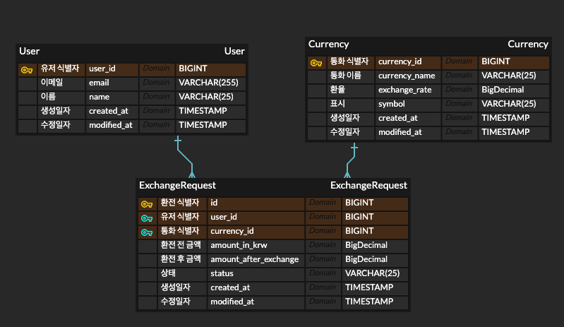

# 연관관계와 예외 처리


## API 명세서
| 기능       | Method | URL                   | 상태코드                                          |
|----------|-------|-----------------------|-----------------------------------------------|
| 환전 요청 수행 | POST | /exchange             | 201:CREATED, 400:Bad Request                  |
| 환전 요청 조회 | GET   | /exchange/{id}        | 200:OK, 400:Bad Request , 404:Not Found     |
| 환전 상태 수정 | PUT   | /exchange/update/{id} | 200:OK, 400:Bad Request , 404:Not Found |
| 환전 요청 삭제 | DELETE | /exchange/{id}        | 204:No Content, 400:Bad Request, 404:Not Found    |


<br>
<details>
<summary> 환전 요청 수행</summary>

|메서드| URL        | 
|----|------------|
|POST| /exchange | 
#### Request
```
{
    ” userId” : “1”,
    “currencyId” : “1”,
    “amountIdKrw” : 10000
}
```

#### Response
```
{
    ”id” : “1”,
    ”userId” : “1”,
    ”currencyId” : “1”,
    ”amountInKrw” : 10000,
    ”amountAfterExchange” : 6.99,
    ”status” : “normal”,
    ”createdAt” : “2024-11-29-01:44:22.000000”,
    "modifiedAt" : “2024-11-29-01:44:22.000000”
}
```
</details>

<details>
<summary> 환전 요청 조회</summary>

| 메서드 | URL            | 
|-----|----------------|
| GET | /exchange/{id} | 

#### Response
```
{
    "id": 1,
    "userId": 1,
    "currencyId": 1,
    "amountInKrw": 10000.00,
    "amountAfterExchange": 6.99,
    "status": "normal”
    ”createdAt” : “2024-11-29-01:44:22.000000”,
    "modifiedAt" : “2024-11-29-01:44:22.000000”
}
```
</details>

<details>
<summary> 환전 상태 수정</summary>

| 메서드 | URL                   | 
|-----|-----------------------|
| PUT | /exchange/update/{id} | 
#### Request
```
{
”status” : “cancelled”
}
```

#### Response
```
{
    “업데이트가 정상적으로 완료되었습니다.”
}
```
</details>

<details>
<summary> 환전 요청 삭제</summary>

| 메서드 | URL            | 
|-----|----------------|
| GET | /exchange/{id} | 

#### Response
```
{
    ”정상적으로 삭제되었습니다.”
}
```
</details>

## ERD 다이어그램



## SQL 쿼리
```
INSERT
```
